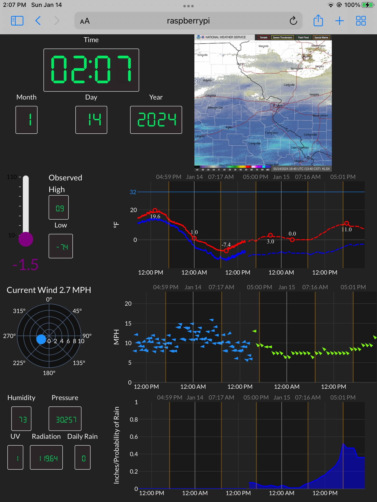

# Weather Station Dashboard

## Background/What is it
When I bought an ambient weather WS-2902, I knew it had the ability to write its data to a custom server.  Unfortunately the documentation on how the weather station sends data was lacking, and most of my searching on the internet for a solution didn't result in anything useful.  I was able to eventally create a [FastAPI](https://fastapi.tiangolo.com/) endpoint that the weather station can write to.  Once I had the weather observations on my server (ahem, raspberry pi) I decided to build a [Plotly Dash](https://dash.plotly.com/) dashboard to display the data on an old iPad.  Once the dahsboard was situated I decided to incorporate forecast data from [The National Weather Service](https://www.weather.gov/documentation/services-web-api) as well as a GIF of the most recent radar loop (full disclosure, as a GIS lover, using this GIF seems like cheating, but it works really well).

### The Weather Station API
A very simple FastAPI powered endpoint to take weather observation data from an Ambient weather WS2902 weather station compute the dewpoint and write it to a CSV.

Roughly based on some of the information from ambient weather here: https://ambientweather.com/faqs/question/view/id/1857/

### The Forecast Data
The NWS has a great free API for accessing forecast data all over the United States.   I have cron tasks set to get the forecast data hourly, and dump it to a set of CSV files since it doesn't change often and the radar loop is updated every 15 min.

### The Dashboard
The Dashboard was built using [Plotly's Dash](https://dash.plotly.com/) framework.  All the plots in the dashboard are automatically updated every 5 minutes, and the current weather conditions (temp, wind, etc) are updated every 15 seconds.  All the data is wrangled using [polars](https://docs.pola.rs/) the sunrise/sunset times used for shading the background of the plots are all calculated by the [astral](https://astral.readthedocs.io/en/latest/) package. 

### Interaction/Tooltips
When you mouse over any of the plots tooltips appear to show details about the data, and applying a filter to the temp/dewpoint figure will subsuquently filter the other figures to the same time period (which is a lot of fun to use when a big cold rain front comes in and the temp drops real fast, the wind picks up and the daily rain skyrockets!)

https://github.com/ATL2001/WeatherStationDashboard/assets/35881864/1dfd9be3-fc9c-4e78-8ffe-91fd0f962fac

